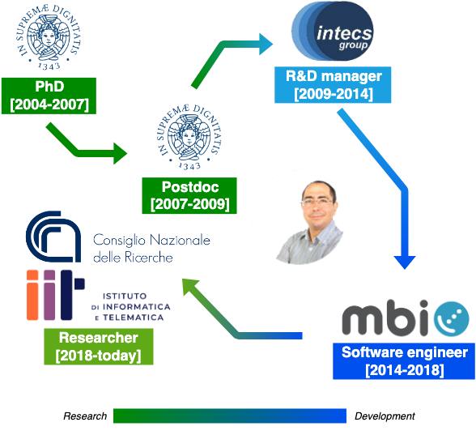

I have a PhD in Information Engineering from the University of Pisa (2007), where I also received my Laurea degree in Computer Science Engineering.
I have been working in [Intecs](http://www.en.intecs.it/) from 2009 to 2013 as an R&D Manager and a Business Unit leader within the Telecommunications division, where I also acted as the official contact for ETSI and Net!Works.
From 2014 to 2018 I have been a software engineer at [MBI](http://mbigroup.it/en/index) working on the design, development, validation, and operation of Software Defined Radio powered satellite communication platforms.
I am now a Researcher in the [Ubiquitous Internet](http://cnd.iit.cnr.it/) group of [IIT-CNR](http://www.iit.cnr.it/), where I am the head of the |Quantum⟩ lab since 2022.
I have been the project manager of projects FP7 CROWD and ESA SAT4NET, and I have been involved in FP7 projects SANDRA and MOTO, FP6 project EuQoS, Celtic WINNER+, and other national R&D projects (QuaSAR, NADIR, IPERMOB, ARTES 4.0, QUANCOM).
I am currently involved in H2020 project [MARVEL](https://www.marvel-project.eu/) and Horizon Europe projects [EDGELESS](https://edgeless-project.eu/) (where I am the scientific manager), [6Green](https://www.6green.eu/), [HPCQS](https://hpcqs.eu/), and [QUID](https://quid-euroqci-italy.eu/); I participate to the National Recovery and Resilience Plan ([NRRP](https://www.italiadomani.gov.it/content/sogei-ng/it/en/home.html)) in three initiatives: [ICSC](https://www.supercomputing-icsc.it/) national centre for High Performance Computing, Big Data and Quantum Computing, National Quantum Science and Technology Institute ([NQSTI](https://www.nqsti.it/)), and SEcurity and RIghts in the CyberSpace ([SERICS](https://serics.eu/en/)).
In 2021 I have been the recipient, with Prof. Enzo Mingozzi, of a research grant awarded by the Networking Team at [Facebook](https://research.fb.com/blog/2021/08/announcing-the-winners-of-the-2021-networking-request-for-proposals-in-internet-and-web-services/).
I am an editor of the IEEE Networking Letters and a member of the program committee of several international conferences (including IEEE PerCom, IEEE WoWMoM, IEEE ISCC, IEEE WCNC, ACM CCgrid).
I co-authored 70+ papers published in international journals, peer-reviewed conference proceedings and book chapters, and two international patents, with an h-index of 28 (Google scholar).
I have an [Erdös number of three](http://www.oakland.edu/enp/) and a [Dijkstra number of four](https://www.csauthors.net/distance/claudio-cicconetti/edsger-w-dijkstra).

## Awards

- Best IIT Grant 2021 Project Award, "SOE2: ServerlessOnEdge 2.0: reliable, faster & better FaaS at the edge"
- Facebook Research Award of "2021 Networking request for proposals in internet and web services" ([announcement](https://research.fb.com/blog/2021/08/announcing-the-winners-of-the-2021-networking-request-for-proposals-in-internet-and-web-services/), [press release in Italian](https://www.unipi.it/index.php/news/item/21844-un-progetto-di-universita-di-pisa-e-cnr-pisano-vince-il-facebook-research-award)) on the topic "Service continuity of serverless computing at the edge via QUIC migration" with [Prof. Enzo Mingozzi](http://www2.ing.unipi.it/~a009395/home/index.htm)
- "On Realizing Stateful FaaS in Serverless Edge Networks: State Propagation", best paper nominee at [SMARTCOMP'21](https://www.smart-comp.info/), see [summary](statefulfaas.md), [presentation on YouTube](https://youtu.be/gc1pQ56UMAA)
- "Serverless Edge Computing: Vision and Challenges" won best paper award at _AusPDC 2021_ [check it out!](https://dl.acm.org/doi/10.1145/3437378.3444367)

