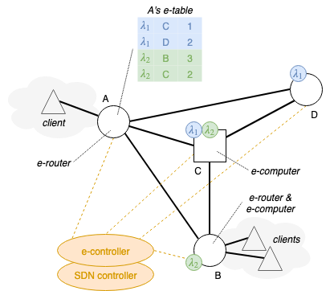

Presented at [IEEE CloudCom 2018](http://cyprusconferences.org/cloudcom2018/), full paper on [IEEEXplore](https://ieeexplore.ieee.org/document/8590993), slides [here](https://www.slideshare.net/cicconetti/design-and-emulation-tools-for-serverless-edge-computing), BibTeX [here](bib/cloudcom2018.bib).

DOI: [10.1109/CloudCom2018.2018.00024](https://doi.org/10.1109/CloudCom2018.2018.00024)

### Topics

- Edge computing
- Serverless / Function-as-a-Service (FaaS)
- Simulation and modelling

### Challenge

How to enable lightweight routing of lambda functions in an edge computing domain.

### Key contribution

Our system model consists of clients in an edge computing domain wishing to perform computation offloading of their applications using a serverless paradigm.
This means that the applications consist of a sequence of remote procedure invocations, called lambda functions, that do not require a state to be installed and maintained on the remote side.
Serverless platforms are typically deployed in data centres, which means that:

1. communication between servers is fast, cheap, and reliable
2. computation resources can be easily scaled up/down with state-of-the-art technology (e.g., [kubernetes](https://kubernetes.io))

Unfortunately, in an edge network both such assumptions fail miserably:

1. communication between edge nodes may happen through (wireless) access network technologies, which have limited bandwidth and may incur significant transfer delays;
2. since the edge devices are not (anywhere) as powerful as the application servers in a data centre and there is a (potentially) high communication overhead for synchronisation, scaling the virtual machines/containers required for the execution of lambda functions is complex and expensive.

**The scientific challenge is: realising a lightweight dispatch of lambda function requests in a network made of devices with limited computational capabilities and connectivity.**

We propose to achieve the above goal by inspiring from the Internet Protocol architecture.
In IP the routers are in charge of forwarding the packets from their source to the destination.
Since this operation must be performed as fast as possible, with some simplification, the routers decide the outgoing interface of every packet based on a highly-optimised local _forwarding table_.
Since the network topology may change over time, such table is subject to change based on the outcome of _routing protocols_, whose dynamics are much much slower than those of packet forwarding.

We do something similar.
In our system model we have:

- _e-routers_: the ingress points of the edge network to which clients connect;
- _e-computers_: the edge nodes offering their computational capabilities to host images for the execution of lambda functions from clients;
- _e-controller_: a logically centralised element that is aware of all the e-routers and e-computers in the edge domaing.

The e-controller installs _e-tables_ on the e-routers, which play the same role as the forwarding table in an IP router: every time an e-router receives a lambda function to be executed, it retrieves from the e-table the list of e-computers able to serve that function.
Such e-tables much slower than the rate at which the e-routers process lambda functions.
This allows the decision algorithm at every e-router to be fast and efficient, with no information being exchanged with its peers.
However, every e-router continuously estimates the average latency experience by lambda requests of any given type when forwarded to every possible e-computer, so as to select the best destination next time the same lambda function will be requested.
This is done by means of changing over time the _weights_ of destinations, as shown also in the example above.

Estimation of the latency is done on a per-lambda manner because different lambdas are served by different containers on the same host: one may be overloaded while another is idle.
However, if the _network_ to reach an e-computer is congested, then _all_ lambda functions there will experience a higher response times.
Unfortunately, by mere measuring the latency a e-routers, we cannot distinguish whether a high latency happens because of congestion of network vs. computation resources.
However, if the underlying network supports Software Defined Networking, the SDN controller (or any other component in charge of network monitoring) may help us in this: whenever there is congestion detection, it informs the e-controller, which in turns changes all the weights to infinity, i.e. that destination will not be considered for all its lambda functions offered.
Once the network congestion resolves, the weights will be reset to an initial value.

To summarise, the interaction between network monitoring and lambda function forwarding allows to _proactively_ respond to (temporary) network congestion before it affects the performance of the serverless services in use, whereas we rely on distributed passive probing and measurement on e-routers to _reactively_ respond to (temporary) overload of the computation resources of e-computers.

### Validation

Methodology:

Performance evaluation on an emulated network in three topologies:

1. line topology where an e-router on the far edge forwards lambdas to e-computers all along the line, with ideal vs. non-ideal communication links, and with vs. without network congestion in the middle of the chain
2. pods topology, to mimic real Mobile Broadband Wireless Access (MBWA) deployments in urban scenarios, where powerful e-computers are located both in the "core" network and constrained e-computers are closed to the users
3. ring-tree topology, with client sessions following an ON/OFF pattern and with background network traffic injected during the experiments

Tools used:

- C++ prototype implementation (not _yet_ publicly available) of e-computer (with simulated processing time), e-router, and e-computer, using [gRPC](https://grpc.io/) for all communications, both signalling and serverless function calls
- [mininet](http://mininet.org/) for network emulation, with extensions to: generate the scenarios; retrieve throughput from the emulated switches; load activity from the real traces; compute shortest paths and install static flow tables in switches

[Short demo on YouTube](https://www.youtube.com/watch?v=pHryny2P864&t=), also showing how a real e-computer (with face/eyes detection) can be reached within the emulated mininet environment from an external serverless client.

We have implemented three policies in the e-router for destination selection, all tested in emulation experiments:

- _Random proportional_: next destination is selected inversely proportional to the estimated latency
- _Least impedance_: send the lamdba function to the e-computer that has the smallest estimated latency
- _Round robin_: serve the e-computers in a weight round robin manner, where the weight is the inverse of the stimate latency

Main findings:

The proposed solution is able to react very well to both fast changing computational load conditions and to temporary network congestion events.
Among the destination selection algoriths, _round robin_ achieved best performance.

### Future research directions

- Improving scalability of e-routers: the number of entries in the e-tables grow linearly with the number of virtual machines/containers offering lambdas in the whole edge computing domain
- Study on processing time overhead in e-routers, especially on low-power devices, e.g., RPi3
- Integration with existing standards, e.g. [ETSI MEC](https://www.etsi.org/technologies/multi-access-edge-computing)
- Integration with existing serverless frameworks, e.g. [Apache OpenWhisk](https://openwhisk.apache.org/)
- Field testing, esp. with small devices
- Definition of architecture and protocols for realising full in-network processing, [Golem](https://golem.network/)-style

