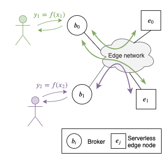
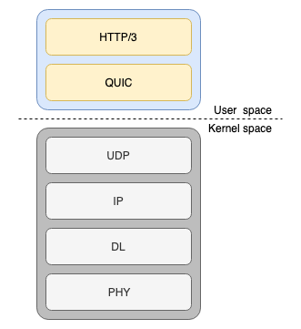
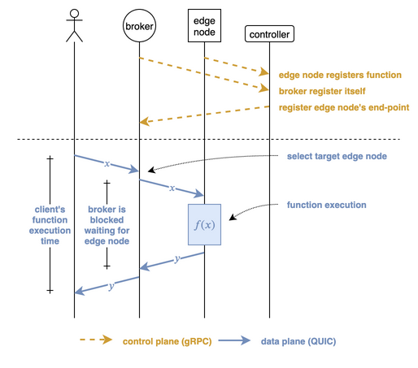

C. Cicconetti, L. Lossi, E. Mingozzi and A. Passarella,
_A Preliminary Evaluation of QUIC for Mobile Serverless Edge Applications_,
1st Workshop on ICT for Integrated Smart Mobility Solutions, co-located with
IEEE 22nd International Symposium on a World of Wireless, Mobile and Multimedia Networks (WoWMoM), 2021, pp. 268-273,
DOI: [10.1109/WoWMoM51794.2021.00050](https://doi.org/10.1109/WoWMoM51794.2021.00050)

### Resources

- full paper on [IEEEXplore](https://ieeexplore.ieee.org/document/9469496)
- [BibTeX](bib/isms2021.bib)
- GitHub repository: [ServerlessOnEdge](https://github.com/ccicconetti/serverlessonedge)
- scripts and artifacts: see experiments from `300` to `304` on [GitHub](https://github.com/ccicconetti/serverlessonedge/tree/master/experiments)

### Topics

- Edge computing
- Serverless & Function-as-a-Service (FaaS)
- QUIC & HTTP/3

### Summary

We consider an edge system where nodes can execute functions on demand following a _serverless_ model.
We assume that the clients send their function execution requests to _brokers_, which dispatch them towards the edge nodes depending on the current load and network conditions.

In this activity, we assume that such dispatching is done with [ServerlessOnEdge](cloudcom2018.md).
For remote function invocation, ServerlessOnEdge uses Google's gRPC, which is based on HTTP/2, which in turn uses TCP as the transport protocol.
The HTTP/2+TCP stack has some known issues:

1. TCP's three-way handshake requires 1.5 RTTs to establish the connection between client and server. When using TLS, which is necessary for authentication and data confidentiality, then 2 further RTTs are needed before data can be exchanged between the peers.
2. TCP does not cope well with packet losses that are not due to congestion, which is especially relevant for mobile and wireless clients. In particular, even though HTTP/2 has the concept of _streams_, which in theory allow the application to multiplex multiple logical channels of data inside the same TCP connection, in practice the kernel will not deliver to the application segments until all the previous ones have been correctly received: this leads to a phenomen called _head-of-line blocking_.

Therefore, we decided to explore the use of [QUIC](https://datatracker.ietf.org/doc/html/rfc9000), a new transport layer using UDP, originally proposed by Google.

In ServerlessOnEdge, we have kept control-plane exchanges on gRPC, but added optional (and experimental) support to QUIC using Facebook's libraries [mvfst](https://github.com/facebookincubator/mvfst) and [proxygen](https://github.com/facebook/proxygen) for data-plane exchanges, i.e., serverless function invocations.

### Main findings

1. We have been able to use HTTP/3+QUIC+UDP as a drop-in replacement of Google's gRPC (using HTTP/2+TCP). This has allowed the migration from TCP to QUIC with relatively small effort. However, this way some important features of QUIC are not used, including stream multiplexing; as a result, the current release of ServerlessOnEdge (v1.1.1) is still subject to head-of-line blocking.
2. QUIC copes well with sporadic to moderate packet loss, resulting in significantly lower end-to-end tail latencies compared to TCP. With severe packet loss, TCP performs better.

Furthermore, it is worth mentioning that with no packet loss and high-speed network links QUIC detected spurious packet losses, leading to unnecessary retransmissions, hence higher traffic consumption than with TCP. We suspect that this can be avoided by a careful tuning of the internal `mvfst` parameters, which however requires a very good understanding of QUIC and _a priori_ knowledge of the network link characteristics (or non-trivial dynamic adaptation).

### Future research directions

- Adoption of the stream multiplexing QUIC feature.
- Experiments in the wild (currently we have used emulated networks).
