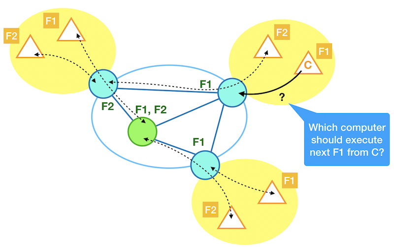

Presented at [IEEE PerCom 2019](http://www.percom.org/), see [slides](https://www.slideshare.net/cicconetti/lowlatency-distributed-computation-offloading-for-pervasive-environments).

DOI: [10.1109/PERCOM.2019.8767419](https://doi.org/10.1109/PERCOM.2019.8767419)

### Topics

- Pervasive computing
- Edge computing
- Serverless / Function-as-a-Service (FaaS)

### Challenge

How to support low-latency applications in a pervasive environment using edge computing.

### Key contribution

Limited to the case of applications that can be decomposed into a sequence of stateless functions, we propose to use a serverless approach to best follow time-varying load/network conditions and, hence, reduce application response times in a dynamic environment.

Our key contribution is illustrated in the picture below.
We show an example edge environment where the clients (triangles) access the network services via their respective access networks (yellow background).
The edge nodes in the core network (circles) play as computers (= they execute functions from clients), dispatchers (= they forward the function execution request from clients to computers), or both.
In the examples there are two function types F1 and F2.
The dotted lines are on-going function request/response exchanges.
**The scientific challenge is: selecting which computer should execute the next function request, in such a way to minimise response times.**

Since computers and network links may be very heterogeneous and the demands highly varying (due to, e.g., mobility of users) we cannot tackle this problem by means of a classical optimisation problem.

Rather, we propose that each dispatcher reacts based on the recent history of previous function calls.
More precisely, any dispatcher sends the function execution request to the computer that is estimate to serve with shortest time, which has been shown to be an excellent policy in the context of multi-server scheduling.
To estimate the function execution request we monitor separately the network delay and computation time: for simplicity we assume that both depend linearly on the function request size, and that the latter only also depends linearly on the current load of the computer (piggybacked on response messages).
By making the system fully distributed we can achieve high scalability.

### Validation

Performance evaluation on an emulated network in two environments:

1. small-scale, with execution of real face detection application
2. large-scale, activity data from [real traces](https://www.nature.com/articles/sdata201555), with simulated execution of Augmented Reality applications

Tools used:

- C++ prototype implementation (not _yet_ publicly available) of: distributed dispatcher; computer not actually executing the task but rather returning the response after a time depending on the simulation of the current backlog; computer performing face and eyes detection using [OpenCV](https://opencv.org/); controller for discovery purposes; 
- [mininet](http://mininet.org/) for network emulation, with extensions to: generate the scenarios; retrieve throughput from the emulated switches; load activity from the real traces; compute shortest paths and install static flow tables in switches

Comparison algorithms:

- **fully distributed** (our proposal)
- shortest path execution
- centralised controller dispatching to all executors based on measurements
- [shortest job next](https://en.wikipedia.org/wiki/Shortest_job_next), non-realistic (only possible with simulated computers)

Main findings:

The proposed solution can cope very well with the dynamics of a fast changing environment.
In particular, in all the scenarios tested, it achieves much lower delays than a static allocation of clients to computers (the way edge computing is usually intended) with a slight increase of the network traffic required.
On the other hand, it scores same or better latency than a centralised approach of function request dispatching, at a small fraction of the network traffic required.

### Future research directions

- Algorithms for adjusting the allocation of function on computers
- More sophisticated estimation/prediction tools
- Further scalability, esp. as the number of function type grows
- Integration with existing standards, e.g. [ETSI MEC](https://www.etsi.org/technologies/multi-access-edge-computing)
- Integration with existing serverless frameworks, e.g. [Apache OpenWhisk](https://openwhisk.apache.org/)
- Field testing, esp. with small devices
- Definition of architecture and protocols for realising full in-network processing, [Golem](https://golem.network/)-style
