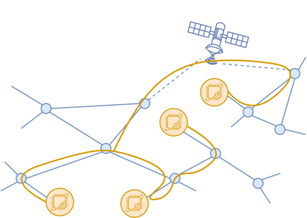

### Resources

- C. Cicconetti, M. Conti, and A. Passarella, _Resource Allocation in Quantum Networks for Distributed Quantum Computing_, IEEE SMARTCOMP 2022, 
[IEEE](https://ieeexplore.ieee.org/document/9820750), [arXiv](https://arxiv.org/abs/2203.06385), [BibTeX](bib/smartcomp2022stateless.bib)
- C. Cicconetti, M. Conti, and A. Passarella, _Quality of Service in Quantum Networks_, IEEE Network, vol. 36, no. 5, pp. 24-31, September/October 2022, [IEEE](https://ieeexplore.ieee.org/document/9964002), [arXiv](https://arxiv.org/abs/2204.09538), [BibTeX](bib/network2022.bib)
- Source code and artifacts on [GitHub](https://github.com/ccicconetti/quantum-routing)

### Topics

- Quantum routing
- Resource provisioning
- Quality of Service
- Traffic engineering

### Summary

Quantum networks enable the interaction and cooperation of quantum computers located in difference places, possibly separated by geographical distances.
This happens via the teleportation and end-to-end entanglement of qubits, which is turn is mediated by the quantum repeaters, which today do not exist yet but will become available for mass production in the next few years.

Quantum networks unlock the opportunities offered by two classes of applications:

1. **Point-to-point traffic flows**, such as Quantum Key Distribution (QKD) and quantum sensing. These applications are typically defined in terms of: source and destination hosts, entanglement rate (i.e., the number of Bell pairs that can be consumed end-to-end in the unit of time), and the minimum fidelity of the entangled qubits.
2. **Elastic applications**, e.g., for distributed quantum computing. These applications are typically defined in terms of: the home host and its peers, as well as the minimum fidelity of the entangled qubits; such applications are greedy for what concerns the entanglement rate: the higher the better, even through ideally they can work with any rate provided.

We investigated the problem of resource provisioning of point-to-point traffic flows in our paper "Quality of Service in Quantum Networks", while "Resource Allocation in Quantum Networks for Distributed Quantum Computing" deals with elastic applications.
In both cases, the analysis is based on quantum network simulations obtained with a custom tool, developed in modern C++ and publicly released as open source on [GitHub](https://github.com/ccicconetti/quantum-routing), together with all the scripts to generate the results published for full reproducibility.
