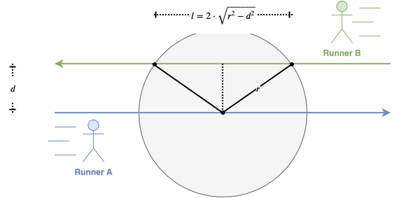
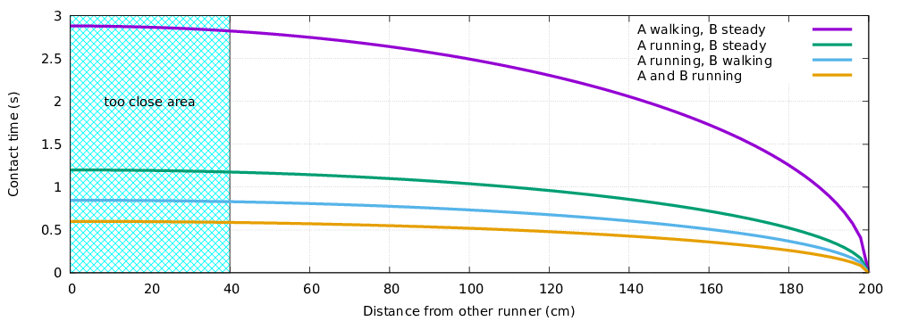

[In italiano](running-it)

During the outbreak of COVID-19, many countries have shut down _running races_, which is perfectly understandable since putting together in close proximity many people sounds like a very bad idea (at least for human beings, whereas it would certainly be considered a _great idea_ from the point of view of the virus).

However, there's another question that is being debated these days (March 2020) in Italy, and supposedly also elsewhere: **can I go running (by myself) without spreading the infection?** [apparently, the unanimous answer from social networks is **NO**, judging from the large number of strong but polite (ahah joking, not polite) invitations to postpone all individual running activities]

Common sense suggests that an absolute answer to this question cannot exist, but rather this is a matter of calculated risk, so let's do the calculations!

CDC [here](https://www.cdc.gov/coronavirus/2019-ncov/php/risk-assessment.html) defined **close contact** as _being within approximately 6 feet (2 meters) of a COVID-19 case for a prolonged period of time_, and a **medium risk level** as being in _close contact with a person with symptomatic laboratory-confirmed COVID-19_.

Of course, if a person has _symptomatic laboratory-confirmed COVID-19_ they are not supposed to be running outdoor, but there is always the risk that a person has been infected by COVID-19 but they don't know (yet). In the worst case, all the other persons that you meet while running might have COVID-19. This is not something that we can easily control or measure. So, let's focus on the _prolonged period of time_ part of the CDC's risk assessment.

We can assume without loss of generality that two runners moving in the same direction can keep a safe distance (greater than 2 meters according to CDC) with a small effort: this is something runners already do anyway (who wants to be in proximity of a sweating and swearing stranger?). However, avoiding a runner coming from the opposite direction is not always possible, so there will be cases where the two paths will be within in _close contact_. The duration of such contact depends on the relative speed of the runners, as you can see in the following diagram:

In the diagram above the persons are modeled as _points_, but in reality they occupy some space; the average should size is about 40 cm, so we can assume that _at least_ that distance will be maintained no matter what.

In the following plot you can find the contact time (in seconds) for any given relative distance between the two runners (up to 2 m, after that you are always safe according to the CDC rules), in four cases, where we consider that:

- _walking speed_ is 5 km/h (12 minutes/km);
- _running speed_ is 12 km/h (5 minutes/km).

As you can see, **the contact time for every encounter you have is shorter than 1 second if at least one of the persons involved is running, and it is always shorter than 3 seconds even if one person is walking while the other is not moving at all.**

Clearly, for every running session you have to multiply by the number of encounters, e.g., if you are running and you meet 20 other persons walking in the opposite direction and you manage to keep a 1 m distance from all, then the total contact time is 20 x 0.75 = 15 seconds. Remember this is a worst-case calculation, under the (questionable) assumption that all the people you meet along your path are infected with COVID-19.

So, does this contact time qualify as _prolonged period of time_? Well, I don't know!

However, now you have some numbers, hopefully of some use to take informed decisions.

