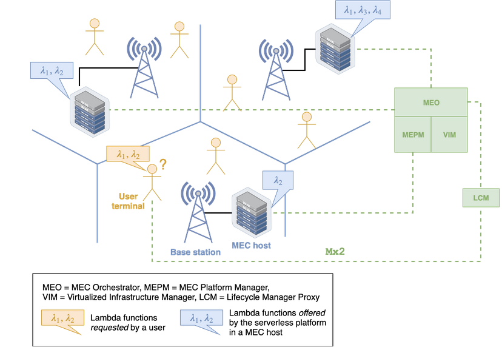
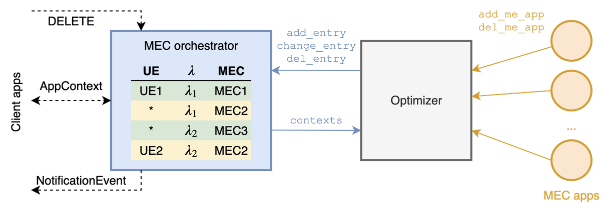

Published in [IEEE Communications Magazine](https://www.comsoc.org/publications/magazines/ieee-communications-magazine), BibTeX [here](bib/commmag2020.bib).

DOI: [10.1109/MCOM.001.1900498](https://doi.org/10.1109/MCOM.001.1900498)

GitHub repository: [Serverless on Edge](https://github.com/ccicconetti/serverlessonedge)

Authors: C. Cicconetti, M. Conti, A. Passarella, and D. Sabella

### Topics

- [ETSI Multi-access Edge Computing](https://www.etsi.org/technologies/multi-access-edge-computing)
- [Serverless computing](https://en.wikipedia.org/wiki/Serverless_computing)

### Challenges

How to optimize run-time execution of stateless tasks executed on ETSI MEC hosts upon changing conditions?

### Key contributions

The target system is illustrated in the following picture.

MEC hosts are deployed by the Mobile Network Operator (MNO) close to the
Base Stations to enable low-latency / high-bandwidth applications.
The MEC hosts rely on a virtualized computation and communication
infrastructure, which is controlled by the Virtualized Infrastructure
Manager, hosted in the MNO's core network.
The MEC hosts run MEC applications that are deployed and managed by the
MEC Orchestrator (MEO), whereas the MEC Platform Manager (MEPM) is in
charge of managing MEC services that may be offered by the MNO to the
MEC applications for (e.g.) user localization or bandwidth reservation.

In the paper we focus on MEC applications only (not on MEC services),
in particular we address serverless platforms, i.e., solutions that
allow clients to invoke functions/triggers in a stateless manner.
Examples of open source serverless platforms are [OpenWhisk](https://openwhisk.apache.org/)
and [Knative](https://knative.dev/); most cloud operators also offer
custom serverless solutions, e.g., [AWS Lambda](https://aws.amazon.com/lambda).

According to the ETSI MEC architecture, the applications on the
user terminal interact with the ETSI MEC system via the `Mx2` REST
interface, which allows to discover the available MEC applications
and to create application contexts for the offloading of (usually
computationally-intensive) tasks from the mobile device to the MEC
hosts.  _The ETSI MEC does not specify how to bind every user/application
to a given MEC host_, which is left unspecified to foster competition
among vendors.

With traditional (i.e., stateful) applications, there is a 1:1
mapping between the client application (running in the user terminal)
and the MEC application counterpart (running in one of the MEC hosts).
A MEC application does not exist before the client application requested
it, and it can be torn down as soon as it is not needed anymore.

On the other hand, with serverless the relation is N:M since:

- a given client application may require the invocations of a
_sequence of functions_;

- the same instance of an executor in a MEC host may serve
different client applications at the same time.

Also, life cycle management becomes more blurred: a given executor
may exist even though no client application has requested it
so far, or is currently invoking its actions, just in case some
clients _in the future_ will request the execution of that lambda
function.

This creates a heavier than usual burden on the MEC orchestrator,
which we propose to reduce by means of a split design illustrated
below.

- the MEC orchestrator takes fast decisions based on a table
that maps the user terminal and requested lambda function
identifiers to a MEC host: when a client requests a new
context to be created for the subsequent execution of lambda
functions, the orchestrator has to simply perform a look-up
in that table;

- the table is updated periodically by an external component,
called _Optimizer_ in the figure, which is notified
about the number of contexts currently active and whenever
a new MEC (serveless) application is created or torn down
in a MEC host; the last step can be done with ETSI MEC on
the `Mp1` REST interface (not implemented in our prototype).

In our prototype available
[here](https://github.com/ccicconetti/serverlessonedge) we have
defined [gRPC](https://grpc.io/) interfaces for the Optimizer,
with the methods illustrated in the diagram above.

In our study we then explore three possibilities:

1. **Baseline solution**: when the Optimizer updates the table,
the changes only affect contexts that will be created in
the future. Thus, the current mapping between client
applications and MEC hosts could be sub-optimal because
it is not immediately reflected on the system.

2. **Notification solution**: as the table changes, all the
currently active contexts affected by the change are notified
through a `POST` command issued by the MEC orchestrator
towards the clients, at an URL that has been specified
upon context creation. Note this solution allows the
optimal mapping to be enforced immediately, but only
in the assumption that the client applications run
an HTTP server to receive notifications, which is possible
but not mandatory in ETSI MEC.

3. **Distributed dispatching**: we implement a distribution solution
where the incoming lambda invocation requests are always directed
to a given MEC applications, which however acts as a broker towards
the (multiple) serverless platforms runnin as MEC applications too.
For this we could implement the solutions that we have studied
[here](cloudcom2018.md) or [here](percom2019.md).

### Validation

We have carried out preliminary validation through emulation using our framework described [here](simpat.md).

Main findings:

- With fast changing conditions, due to either mobility of traffic
distribution, the notification solution and distributed dispatching
described above provide client applications with more consistent
performance, in terms of the response time of lamdba function
invocations.

- This comes at a cost in terms of client application complexity
(for the notification solution, which requires an HTTP server to
receive `POST` commands) or network traffic (for the distributed
dispatching).

### Future work

- Integration of [our open source prototype](https://github.com/ccicconetti/serverlessonedge) with [OpenNESS](https://www.openness.org/) or the [ETSI MEC emulation platform](https://github.com/InterDigitalInc/AdvantEDGE/wiki)

