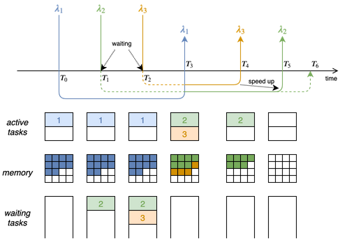

Published in [Simulation Modelling Practice and Theory](https://www.sciencedirect.com/journal/simulation-modelling-practice-and-theory), BibTeX [here](bib/simpat.bib).

DOI: [10.1016/j.simpat.2019.102007](https://doi.org/10.1016/j.simpat.2019.102007)

GitHub repository: [Serverless on Edge](https://github.com/ccicconetti/serverlessonedge)

### Topics

- Distributed task scheduling
- Edge computing
- Performance evaluation

### Challenges

1. How to dispatch tasks in a distributed computing environment
2. How to evaluate the performance of edge computing systems

### Key contributions

This work is an extension of [Low-latency distributed computation offloading for pervasive environments](percom2019.md), which contains the core contribution addressing challenge 1: an overlay of _dispatcher_ elements co-located with edge nodes that estimate the job execution time for every lambda from any client to possible processing elements to predict the execution time of incoming lambda requests and decide the destination accordingly.

In the extended paper we enrich this proposal by also running testbed experiments to measure the associated processing overhead on high-end Intel Xeon servers and low-end SoC computers (Raspberry Pi3): the results show that the latter may handle a number of possible destinations per lambda in the order of hundreds, whereas full-fledged servers do not exhibit significant slow-down until loaded with thousands of destinations per lambda function.

Furthermore, we address here the challenge 2 above, by illustrating in detail the framework used for the performance evaluation, consisting of:

- network emulation, done with [mininet](http://mininet.org/)
- full implementation of the dispatchers, implemented in C++ and communicating with [gRPC](https://grpc.io/)
- real processing computers performing face/eyes detection using [OpenCV](https://opencv.org/)
- emulated computers that respond to the lambda requests after a time obtained through an internal simulation of a multi-processor containerized application scheduling best-effort tasks with a first-come-first-server policy (see example in the figure below)

### Validation

First, the emulated computer is shown to add negligible overhead, unless simulating tasks with very short duration (order of milliseconds).

Furthermore, we have run two additional scenarios (with respect to the [conference version](percom2019.md)):

1. Comparison of our proposed distributed dispatcher with a near-optimal centralized solution proposed in the work [Online job dispatching and scheduling in edge-clouds](https://doi.org/10.1109/INFOCOM.2017.8057116) and a distributed tasklet scheduling solution from [Context-aware data and task placement in edge computing environments](https://doi.org/10.1109/PERCOM.2019.8767386), under different heterogeneous network/load conditions.
2. A sensitivity analysis aimed at studying the relative, possibly compound, effects of the system parameters on the performance in terms of the key performance metrics, using our tool [factorial2kr](https://github.com/ccicconetti/factorial2kr).

Main findings:

- The proposed solution achieves good performance with fast changing network and load conditions, compared to solutions from the literature.
- The performance evaluation framework is efficient and flexible, thus it may easily accommodate a wide range of scenarios of interest.

### Future work

- Extension of the dispatcher with more sophisticated task execution time estimation algorithms, e.g., using AI/ML techniques.
- Integration of the performance evaluation framework with [uiiit::etsimec](https://github.com/ccicconetti/etsimec)
- Releasing the framework as _open source_, which requires clean-up and documentation writing; if interested please contact me
