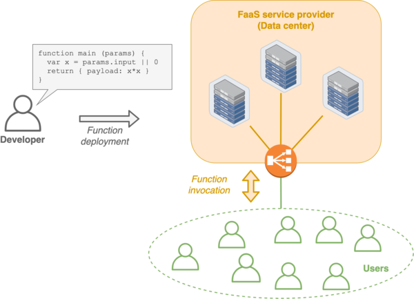
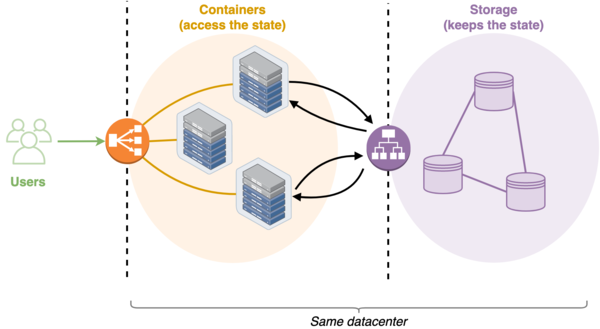
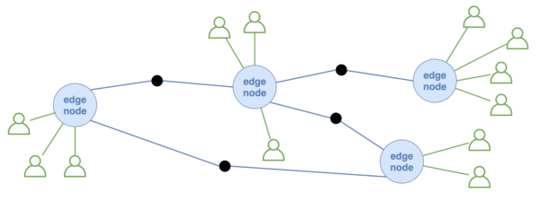
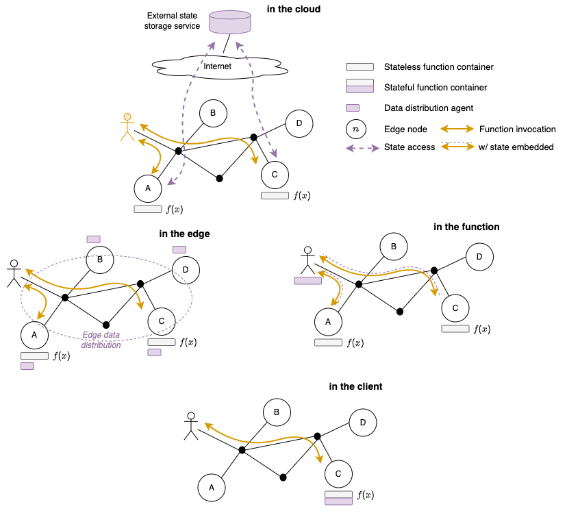
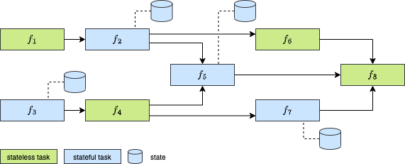

[1] C. Cicconetti, M. Conti, and A. Passarella,
_On Realizing Stateful FaaS in Serverless Edge Networks: State Propagation_,
IEEE International Conference on Smart Computing 2021 (SMARTCOMP'21),
[IEEE](https://doi.org/10.1109/SMARTCOMP52413.2021.00033),
[BibTeX](bib/smartcomp2021.bib).

[2] C. Cicconetti, M. Conti, and A. Passarella,
_FaaS execution models for edge applications_,
Pervasive and Mobile Computing, 2022,
[Elsevier](https://doi.org/10.1016/j.pmcj.2022.101689),
[arXiv](https://arxiv.org/abs/2111.06595),
[BibTeX](bib/pmc2022faas.bib).

[3] C. Cicconetti, M. Conti, and A. Passarella,
_In-Network Computing With Function as a Service at the Edge_,
IEEE Computer, vol. 55, no. 9, Sept. 2022,
[IEEE](https://doi.org/10.1109/MC.2021.3130659),
[arXiv](https://arxiv.org/abs/2209.02983),
[BibTeX](bib/computer2022in-network.bib)

### Resources

- conference presentation of [1] on [YouTube](https://youtu.be/gc1pQ56UMAA)
- source code and artifacts on GitHub:
  - [simulations](https://github.com/ccicconetti/serverlessonedge/tree/master/StateSim) [1, 3]
  - prototype experiments [2]: [400](https://github.com/ccicconetti/serverlessonedge/tree/master/experiments/400_Simple_function_chain), [401](https://github.com/ccicconetti/serverlessonedge/tree/master/experiments/401_Simple_function_dag), [402](https://github.com/ccicconetti/serverlessonedge/tree/master/experiments/402_Motivation_dag)

### Topics

- edge computing
- serverless / Function-as-a-Service
- stateful applications

### Summary

##### Introduction

Function-as-a-Service (FaaS) is a new programming model where a developer only writes _functions_.
They are then deployed in a run-time environment managed by a serverless platform in the cloud, which takes care of the auto-scaling of the containers that are used to execute the functions based on the instantaneous user demands.
This enables, at least in principle, infinite scalability with no burden on the developer or service provider.

FaaS implicitly assumes that all functions are stateless (= the output only depends on the input provided by the users), which is key to allow the serverless platform to scale up/down the number of containers dedicated to a given function.
Since not all services can be made of pure stateless functions only, the typical architecture used in serverless production systems also involves a storage system that is used to keep the applications' states: when a container is activated to execute a given stateful function, it first retrieves the state from the storage system, then it runs the function, and finally it updates the state in the storage system (if modified).

However, the architecture above does not suit well the structure of a typical edge network, since both compute resources on edge nodes _and_ users are distributed over the network, which may cover a large area and be made of unreliable or slow connection links.

Therefore, in [3] we have studied four options where the application's state could be located to enable **stateful FaaS**:

- in the cloud: use storage/in-memory services offered by public cloud providers, such as [Redis](https://redis.io/)
- in the edge: use a distributed storage system at the edge, e.g., [Akka](https://akka.io/)
- in the function: pass along the state on each function call
- in the client: keep everything in the caller

Our results have shown that the _in the function_ and _in the client_ approaches are promising as they can surpass the other alternatives, in terms of end-to-end latency and network traffic, while being simple and amenable to system optimizations. Thus, we have explored these two options in particular, as reported below.

##### Solutions

In [1] we have proposed three strategies to implement the _in the function/client_ approaches:

1. _Pure FaaS_: State is embedded into function arguments and return value.
2. _State propagation_: State is propagated along the chain of function invocations.
3. _State local_: State is stored by the edge nodes and retrieved as needed during the function execution.

We have then extended in [2] the strategies to more generic workflows that can be modeled as _directed acyclyc graphs_ (DAGs), for example:

With stateful DAG applications, the causal consistency of the execution must be guaranteed.
We have proposed to do so by defining, for each state, the order in which the tasks depending on it will be executed.
The three strategies above need to be extended as follows to support DAG workflows:

1. _Pure FaaS_: no change needed.
2. _State propagation and State local_: workers must support asynchronous function calls, the binding between functions and edge nodes must be known to all workers during a single DAG execution, and the states cannot be propagated along with the arguments.

##### Main findings

We have evaluated the performance of the proposed solution using a combination of simulations and prototype experiments in emulated networks.

**Simulations.** We have performed a large number of numerical simulations using a Monte Carlo method with artificial network topologies (generated using [Ether - Edge topology synthesizer](https://github.com/edgerun/ether)) and workloads (created with [Spar: Cluster trace generator](https://github.com/All-less/trace-generator)) to compare the three strategies proposed, _only for chain of functions_, and we have found that:

- State local requires the least amount of network traffic to serve the same workload. This leads to significant end-to-end response time reduction, especially at high percentiles.
- With state local, the performance of chains of function invocations is more stable as the chain size increases, whereas longer chains incur signicant degradation with the other strategies.
- A pure FaaS approach produces the worst result according to all the performance indices considered.

**DAGs.** We have implemented the execution models in [ServerlessOnEdge](https://github.com/ccicconetti/serverlessonedge), which was then used in a sample scenario with 6 edge nodes emulated with [mininet](https//mininet.org/), and we have found that:

- With function chains, there is a trade-off between keeping the state local to edge nodes and embedding it into function invocations, depending on the state size and network speed. State propagation always performs better than pure FaaS.
- With function chains, even with a high network speed, keeping the state local has a significantly lower overhead than the other schemes, in terms of the traffic rate required, but this not always translates into a lower end-to-end latency.
- With a high number of functions in DAGs, state propagation is only effective if references are carried within the function invocations and responses.

### Future research directions

We need to better understand the implications of the different strategies in terms of:

- the programming model and developers' APIs;
- the run-time optimization opportunities that can be exploited at a platform level.
