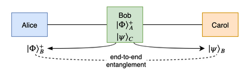
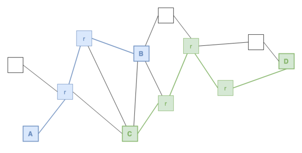
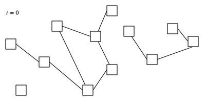

C. Cicconetti, M. Conti, and A. Passarella,
_Request Scheduling in Quantum Networks_,
IEEE Transactions on Quantum Engineering, vol. 2, pp. 2-17, 2021, Art no. 4101917,
DOI: [10.1109/TQE.2021.3090532](https://ieeexplore.ieee.org/document/9461156)

### Resources

- full paper on [IEEEXplore](https://ieeexplore.ieee.org/document/9461156) [CC BY 4.0]
- [BibTeX](bib/tqe2021.bib)
- source code and artifacts on [GitHub](https://github.com/ccicconetti/netsquid)

### Topics

- Quantum Internet routing
- Entanglement swap

### Summary

The development of quantum technology has accelerated significantly in the recent past due to worldwide private and public investments.
In parallel, a new need has emerged: interconnecting quantum systems in a such a way that they can share entanglement of their qubits, e.g., for deployment of distributed quantum computing applications across geographical distance.
Unfortunately, quantum communications are rather fragile, thus it is not possible today for two quantum computers a few tens of km apart to interact.
One way to overcome this limitation is to introduce _quantum repeaters_ to extend the communication range: in the picture below Carol acts as a quantum repeater to allow Alice and Bob to share a quantum entangled state.

In our paper we push this concept even further and consider a _network_ of quantum repeaters (globally, we can call it the Quantum Internet), which allows any two quantum nodes to share a quantum entangled state via a series of intermediate quantum repeaters.
In the example below, the quantum nodes A and B can share an entangled quantum state through two intermediate quantum repeaters, at the same time as C and D do via three intermediate quantum repeaters.

Like in the traditional Internet, _routing_ is an important aspect of the Quantum Internet, even though the constraints and challenges are very different because qubits cannot be copied (due to the [no-cloning theorm](https://en.wikipedia.org/wiki/No-cloning_theorem)) or manipulated as classical bits.
Instead, entanglement must be prepared beforehand by sharing a couple of entangled _flying qubits_ (typically photons on an optical fibre) between adjacent nodes in the network, which are then copied into _matter qubits_ (for instance, ion traps in quantum memories).
Because of current technological limitations, this operation may fail, which results into the network having a different topology (because not all connection links can be used) at every new local entanglement cycle, i.e., hundreds or thousands of time per second.

The key differences of routing in classical vs. quantum networks are summarised as follows.

| Classical networks | Quantum networks |
|-|-|
| Topology is very stable | Topology changes every few ms |
| Routing is executed sporadically as an offline optimisation process | Routing is a continous process with a very short deadline |
| Routing optimised based on long-term traffic estimates | Routing depends on instantaneous pending requests |

In this research activity we aim at meeting the requirements of routing in quantum networks by exploiting its distinguishing features.
More specifically, when taking a routing decision at a given time we propose to put aside (= _skip_) those requests to establish an entanglement between nodes X and Y which can be created only at a high cost (e.g., in number of hops) with the current reduced topology.
We do so in the hope that in the future creating an entanglement between those two nodes X and Y will cost less, because the local entanglements in the network are more favourable.
We have called _scheduling_ the process of deciding which requests to skip.

We have defined three scheduling strategies:

1. _Strict FIFO_: Never skip requests.
2. _Best FIFO_: Always skip requests that cost more than a long-term average cost (but reconsider them if there are spare resources).
3. _Random FIFO_: Skip requests with a probability that depends on their current cost (but reconsider them if there are spare resources).

### Main findings

We have run quantum network simulations using [NetSquid](https://netsquid.org/) in different topologies and with varying request loads.
The results have shown that skipping requests is always beneficial compared to a baseline solution, in terms of all the performance indices considered, including the network entanglement rate, the fidelity (i.e., the quality of the end-to-end entanglement), and the latency experienced by nodes between when they request entanglement and when it is granted.

### Future research directions

- Extension to multipartite entanglement.
- Integration with communication protocols and link layer stacks.
- Analysis of the relation between distributed quantum applications and underlying interconnection network.
- Study of the fairness vs. efficiency trade-off in local link state routing protocols.
- Extension to multiple local entanglement per node pair.
- Definition of a SLAs for distributed quantum applications and service differentiation.
- Further simulations with more general topologies and application request models.
