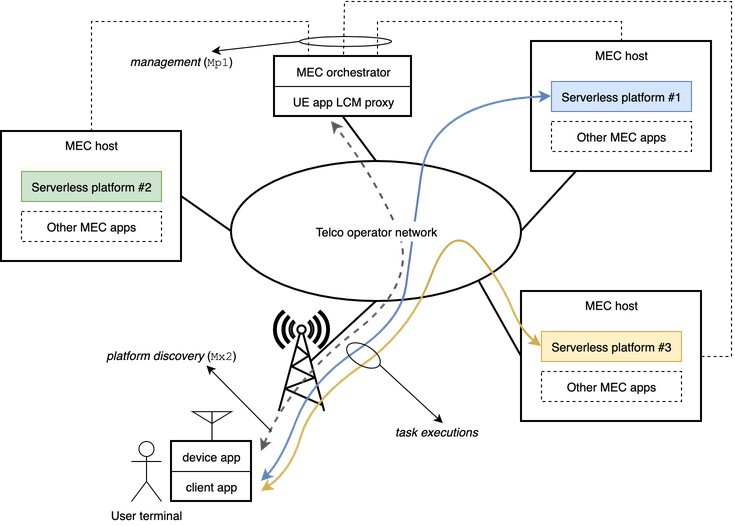

Published in [Computer Networks](https://www.journals.elsevier.com/computer-networks), BibTeX [here](bib/uncoord.bib).

DOI: [10.1016/j.comnet.2020.107184](https://doi.org/10.1016/j.comnet.2020.107184)

GitHub repositories:

- [markovsim](https://github.com/ccicconetti/markovsim): Markov M/M/1 queue model
- [Serverless on Edge](https://github.com/ccicconetti/serverlessonedge): prototype implementation

Authors: C. Cicconetti, M. Conti and A. Passarella

### Topics

- Internet of Things
- Edge computing
- Serverless / Function-as-a-Service (FaaS)
- Numerical analysis

### Challenge

To design a simple uncoordinated scheme for IoT applications to exploit the availability of multiple serverless platforms hosted on edge nodes

Bonus: to support the reference architecture and interfaces of [ETSI MEC](https://www.etsi.org/technologies/multi-access-edge-computing)

### Key contribution

Our target system is illustrated by means of the following example:

The system consist of:

- serverless platforms (SEPs), which in ETSI MEC are deployed as MEC apps in MEC hosts but can be agnostic of the standard;
- a MEC orchestrator that is informed of the serverless platforms available and their characteristics via the interface `Mp1` (and others);
- a UE app LCM proxy, which is the ETSI MEC component in charge of communicating between the orchestrator and the user terminals;
- the user terminal, which includes:
  - a Device app, which is aware of the ETSI MEC system and communicates with the UE app LCM proxy via interface `Mx2`;
  - a Client app, which is ETSI MEC agnostic and requires the execution of stateless tasks offered by the SEPs.

Using the ETSI MEC procedures, the Client app can retrieve one or more end-points upon request to the platform through the Device app.

We propose that this set of end-points is used by the client application to run the following uncoordinated scheme:

- at any given time, only one SEP is considered _primary_ (can be selected at random upon receiving the list initially);
- all the other SEPs are considered _secondary_;
- in general, all task executions are directed to the primary SEP only;
- however, before requesting the execution of any task, the Client select a secondary SEP as _probing_ with probability _p_;
- tasks are requested from the primary and probing SEP alike, and the response delays are measured by the client: if the probing SEP achieves a smaller delay, then it becomes the primary.

This scheme is illustrated in the example sequence diagram below.

### Validation

1. Numerical analysis with a Markov M/M/1 queue model available [here](https://github.com/ccicconetti/markovsim)
2. Prototype C++ implementation of the full system available [here](https://github.com/ccicconetti/serverlessonedge), in an emulated network using [mininet](http://mininet.org/)

The latter has been used to run experiments in both a small-scale topology, to validate the numerical analysis results, and in a large-scale realistic IoT topology extracted from the [Waggle platform](https://arrayofthings.github.io/).

Main findings:

- the proposed uncoordinated scheme reduces the delay of response times compared to a static allocation of clients to serverless platforms;
- when compared to both a centralized load balancing solution and a distributed dispatching approach, our proposed scheme:
  - is much simpler (no synchronisation, no brokers);
  - requires much less network traffic (thanks to the absence of coordination);
  - incurs a small additional load on the serverless platforms (due to probing).

### Future research directions

- Field testing, esp. with resource constrained devices
- System-wide optimisation of the probing probability _p_
